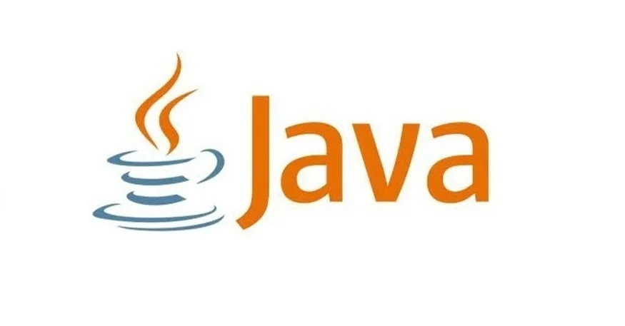

## Java là gì?
Java là một ngôn ngữ lập trình hướng đối tượng, dựa trên lớp được thiết kế để có càng ít phụ thuộc thực thi càng tốt (Theo wikipedia)  

   

Các bạn có thể hiểu Java là một ngôn ngữ lập trình hướng đối tượng (OOP), nó xoay quanh việc thiết kế các lớp (class) và tạo các đối tượng (Object). Ban đầu được phát triển bởi hãng Sun Microsystems do James Gosling khởi xướng và phát hành vào năm 1995.   
Khác với phần lớn ngôn ngữ lập trình thông thường, thay vì biên dịch mã nguồn thành mã máy hoặc thông dịch mã nguồn khi chạy, Java được thiết kế để biên dịch mã nguồn thành bytecode, byte code sau đó sẽ được môi trường thực thi.  

## Đặc điểm của Java  

**Hướng đối tượng**: Mọi thực thể trong chương trình đều là đối tượng. Lưu ý, Java không hỗ trợ đa kế thừa, mà nó đưa ra khái niệm interface để hỗ trợ tính đa kế thừa  

**Độc lập nền tảng**: Khi Java được biên dịch, nó không được biên dịch thành ngôn ngữ máy nền tảng cụ thể, thay vào đó là bytecode. Bytecode được thông dịch bởi máy ảo Java (JVM) trên nền tảng nào đó mà nó đang chạy  

**Cơ chế thu gom rác**: khi các đối tượng được tạo ra trong Java, chúng sẽ được JRE tự động cấp phát không gian bộ nhớ cho các đối tượng trên heap  

**Khả chuyển**: Ứng dụng được viết bằng ngôn Java có thể chạy trên mọi hệ điều hành miễn là có máy ảo Java  

**Đa nhiệm - Đa luồng**: Java cho phép hoạt động đa tiến trình, tiểu trình có thể hoạt động song song cùng một thời điểm và có thể tương tác với nhau  