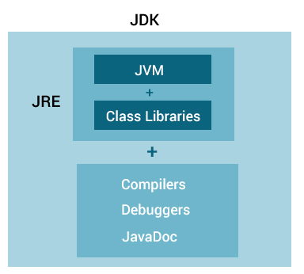

## JDK  

JDK - Java Development Kit: Bộ công cụ phát triển Java, là môi trường phát triển phần mềm được sử dụng để tạo các ứng dụng applet và Java. Các nhà phát triển Java có thể sử dụng JDK trên Windows, macOS, Solaris, Linux. JDK giúp cho việc viết code và chạy các chương trình Java. Có thể cài đặt nhiều phiên bản JDK trên một máy tính  
- JDK chứa các công cụ cần thiết để viết chương trình Java và JRE để thực thi chúng  
- Nó bao gồm một trình biên dịch (Compiler), trình khởi chạy ứng dụng Java (appilcation laucher),...  
- Trình biên dịch chuyển đổi mã được viết bằng Java thành bytecode  
- Trình khởi chạy ứng dụng Java mở một JRE, tải lớp (class) cần thiết và  thực thi phương thức chính của nó  

## JVM  
JVM - Java Virtual Machine:  Máy ảo Java, là một công cụ cung cấp môi trường runtime để chạy code hoặc ứng dụng Java  
Nó chuyển đổi Java bytecode thành ngôn ngữ máy, JVM là một phần của JRE   
- JVM cung cấp cách thực thi mã nguồn Java độc lập với nền tảng  
- JVM có nhiều thư viện, công cụ và framework  
- Khi bạn chạy một chương trình Java, bạn có thể chạy trên bất kỳ nền tảng nào và tiết kiệm  rất nhiều thời gian  
- JVM đi kèm với trình biên dịch JIT (Just In Time) giúp chuyển đổi mã nguồn Java thành ngôn ngữ máy cấp thấp. Do đó, nó chạy nhanh hơn một ứng dụng thông thường  

##  JRE  
JRE - Java Runtime Enviroment: là gói phần mềm cung cấp các thư viện lớp Java. Nó bao gồm các thư viện lớp, bộ nạp lớp và JVM  
Nói một cách dễ hiểu, nếu bạn muốn chạy một chương trình Java, bạn cần có JRE.  
JRE chứa các thư viện lớp, JVM và các tệp hỗ trợ khác. Nó không bao gồm bất kỳ công cụ nào để phát triển Java như trình gỡ lỗi, trình biên dịch,...    
 
***Mối quan hệ giữa JVM, JRE và JDK***  

