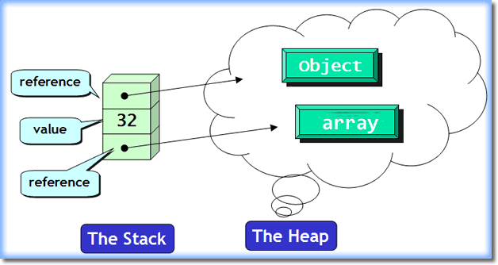

Heap và stack memory là một phần của bộ nhớ được JVM sử dụng để chạy chương trình Java. Khi chương trình Java chạy, JVM sẽ yêu cầu hệ điều hành cấp cho một không gian bộ nhớ trong RAM để dùng cho việc chạy chương trình. JVM sẽ chia bộ nhớ được cấp phát này thành 2 phần: Heap và Stack  

## Java Heap Memory  
Java Heap Memory là bộ nhớ được sử dụng ở runtime để lưu các Object. Bất cứ khi nào một object được tạo thì nó sẽ được lưu trong Heap (thực thi toán tử `new`)  
Các object trong heap đều được truy cập bởi tất cả các nơi trong ứng dụng, bởi các thread (luồng) khác nhau  
Thời gian sống của object phụ thuộc vào Garbage Collection (Quá trình thu gom rác) của Java  
Garbage Collection sẽ chạy trên bộ nhớ Heap để xóa các object không được sử dụng nữa, nghĩa là object không được referece trong chương trình   
Dung lượng sử dụng của Heap tăng giảm phụ thuộc vào objects sử dụng và thường có dung lượng lớn hơn Stack    

## Java Stack Memory  
Bộ nhớ để lưu các biến local trong hàm và lời gọi hàm ở runtime trong một thread Java   
Các biến local bao gồm loại nguyên thủy và loại tham chiếu tới đối tượng trong Heap khai báo trong hàm, hoặc đối số được truyền vào hàm, thường có thời gian sống ngắn.  
Bộ nhớ Stack thường nhỏ  
Cơ chế hoạt động LIFO (Last In First Out), chạy sau chết trước  
Bất cứ khi nào gọi một hàm, một khối bộ nhớ mới sẽ được tạo ra trong Stack cho hàm đó để lưu các biến local. Khi hàm thực hiện xong, khối bộ nhớ cho hàm sẽ bị xóa và giải phóng bộ nhớ trong Stack    

  

## Sự khác nhau giữa Stack và Heap  

| Heap Memory | Stack Memory |
|---|---|
| Java Heap Memory là bộ nhớ được sử dụng ở runtime để lưu các Objects. Bất cứ khi nào Object được tạo bằng `new` thì nó sẽ được lưu trong Heap | Stack Memory là bộ nhớ để lưu các biến Local trong hàm và lời gọi hàm ở runtime trong một thread Java |  
| Thời gian sống của Heap thường dài hơn Stack  do thời gian sống của Object phụ thuộc vào Garbage Collection | Thường có thời gian sống ngắn |  
| Các Object trong Heap đều được truy cập bởi tất cả các nơi trong ứng dụng, bởi các threads khác nhau | Stack chỉ được sử dụng cho một Thread duy nhất. Thread ngoài không thể truy cập vào được |  
| Cơ chế hoạt dộng của Heap phức tạp hơn. | Hoạt động theo cơ chế LIFO |   
| Dung lượng Heap lớn hơn Stack | Dung lượng Stack thường nhỏ |  
| Khi Heap bị đầy chương trình hiện lỗi java.lang.OutOfMemoryError: Java Heap Space | Khi stack bị đầy bộ nhớ, chương trình phát sinh lỗi: java.lang.StackOverFlowError |
| Truy cập vùng nhớ Heap chậm hơn Stack. | Truy cập stack nhanh hơn Heap |  
| Dung lượng sử dụng của Heap sẽ tăng giảm phụ thuộc vào Objects sử dụng. | Bất cứ khi nào gọi 1 hàm, một khối bộ nhớ mới sẽ được tạo trong Stack cho hàm đó để lưu các biến local. Khi hàm thực hiện xong, khối bộ nhớ cho hàm sẽ bị xoá, và giải phóng bộ nhớ trong stack. | 