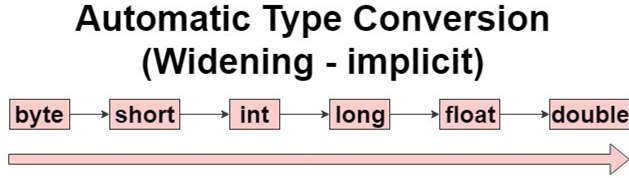
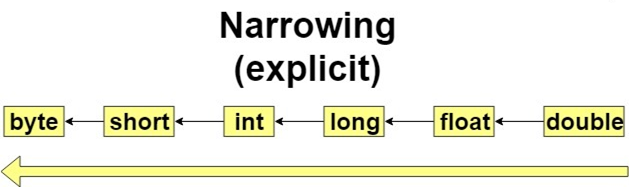

## Ép kiểu
Ép kiểu là cách chuyển đổi kiểu dữ liệu này thành biến thuộc kiểu dữ liệu khác
***Ý nghĩa:***
- Việc chuyển kiểu dữ liệu sẽ đến lúc phải cần trong quá trình xử lý chương trình
- Có thể định dạng đúng kiểu dữ liệu mình mong muốn

***Các cách ép kiểu dữ liệu nguyên thủy***: Có 2 cách để ép kiểu:

**1, Chuyển đổi kiểu ngầm định**
Việc chuyển đổi sẽ tự thực hiện bởi compiler và chúng ta không cần làm gì. Việc chuyển đổi này chỉ dành cho kiểu dữ liệu nhỏ sang kiểu dữ liệu lớn hơn. Ta có thể xem chiều từ nhỏ sang lớn như sau:



Ví dụ:
```java
int a = 5;
long b = a;
System.out.println(b);
```

**2, Kiểu chuyển đổi tường minh**
Ngược lại với chuyển đổi ngầm định, việc chuyển đổi tường minh là chiều ngược lại từ dữ liệu lớn hơn sang kiểu dữ liệu nhỏ hơn. Tuy nhiên với kiểu chuyển đổi này có thể gây ra mất mát dữ liệu



Ví dụ:
```java
long a = 6;
int b = (int) a;
System.out.println(b);
```

Với ví dụ sau sẽ gây mất dữ liệu:
```java
double height = 1.7;
int h = (int) height;
System.out.println(h);
```
Ở kết quả trả về bạn sẽ thấy mất mát dữ liệu:
```
1
```  
