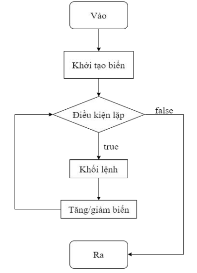

## Vòng lặp trong Java  
Trong lập trình, vòng lặp được sử dụng một cách thường xuyên và mục đích là để thực thi nhiều lần một đoạn chương trình.  
Java hỗ trợ 3 loại vòng lặp khác nhau:  
- Vòng lặp `for`
- Vòng lặp `while`
- Vòng lặp `do-while`  

Ngoài ra, còn có `for each` được thêm vào từ phiên bản Java 5 sử dụng để duyệt mảng hoặc collection  

## Vòng lặp for  
Cú pháp:  
```java
for(<Khởi tạo biến>; <Điều kiện lặp>; <Tăng/Giảm biến>){
    <Khối lệnh>;
}
```  

  

Trong đó:  
- Bước khởi tại biến là bước đầu tiên và chỉ thực hiện duy nhất một lần  
- Kiểm tra điều kiện lặp. Nếu điều kiện đúng, thực hiện khối lệnh. Nếu điều kiện sai, thoát khỏi vòng lặp  
- Trong trường hợp điều kiện đúng, sau khi thực hiện khối lệnh, tiến hành tăng/giảm biến và sau đó quay lại kiểm tra điều kiện lặp  

Ví dụ:  
```java  
for (int i = 0; i < 5; i++){
    System.out.println("Xin chào!!!");
}
```

```java
for(int i = 0; i <= 10; i++){
    if(i % 2 == 0){
        System.out.println(i);
    }
}
```

Hoặc
```java
for(int i = 10; i >= 0; i--){
    System.out.println(i);
}
```