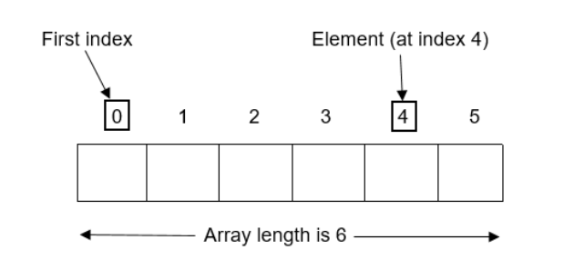

## Mảng là gì?  
Mảng là tập hợp các đối tượng có cùng kiểu dữ liệu, được lưu trữ gần nhau trong bộ nhớ. Mỗi đối tượng được gọi là phần tử, các phần tử này được truy xuất thông qua chỉ số (index), chỉ số của phần tử đầu tiên là 0  
Với mảng trong Java chúng ta chỉ có thể lưu trữ một tập các phần tử có số lượng cố định  

  

Việc sử dụng mảng mang ý nghĩa lưu trữ các giá trị liên quan với nhau. Ví dụ như lưu điểm kiểm tra của các học viên trong một lớp, khi muốn lấy điểm của học viên nào đó thì chỉ cần biết vị  trí (index) của học sinh trong danh sách  

## Ưu điểm và nhược điểm  
### Ưu điểm  
- Gom các phần tử liên quan với nhau, giúp tối ưu code  
- Có thể truy cập ngẫu nhiên  

### Nhược điểm  
- Số lượng phần tử bị cố định, không thể thay đổi kích thước trong lúc runtime  

## Phân loại mảng  
- Mảng một chiều 
- Mảng đa chiều

### Mảng một chiều  
**Khai báo mảng**  
```java
<Kiểu dữ liệu> <Tên mảng>[];
//hoặc  
<Kiểu dữ liệu> []<Tên mảng>;
```

**Cấp phát bộ nhớ cho mảng**  
```java
<Tên mảng> = new <Kiểu dữ liệu>[<Kích thước mảng>];
```  

Ví dụ:  
```java
int[] numbers; //Khởi tạo mảng số nguyên numbers
numbers = new int[3]; //Kích thước mảng là 3 (Có thể chứa 3 phần tử)
numbers[0] = 5; //Gán giá trị cho mảng
numbers[1] = 8;
numbers[2] = 2;
```  

Hoặc  
```java
String[] names = {"Chris", "Emma", "John", "Robert"};
System.out.println(names[2]); //Lấy ra phần tử ở index 2

System.out.println("Kích thước mảng:" + names.length);
//phương thức length để lấy kích thước mảng
```

### Duyệt mảng một chiều  
**Duyệt mảng**

Bất kỳ vòng lặp đơn giản nào cũng có thể được sử dụng để duyệt mảng. Trong ví dụ dưới đây mình sẽ sử dụng cả vòng lặp `for` và `while` 
- Với vòng lặp `for`:  
```java
for(int i = 0; i < names.length; i++){
    System.out.println(names[i]);
}
```
Trong trình duyệt mảng, sử dụng một biến số nguyên (i) bắt đầu từ 0, do chỉ số của mảng bắt đầu từ 0 và tiến tới độ dài của mảng trừ 1. Ví dụ mảng có 5 phần từ thì sẽ duyệt từ 0 đến 4.

- Với vòng lặp `while`

```java
int i = 0;
while(i < names.length){
    System.out.println(names[i++]);
}
```
Biến i được khai báo bên ngoài vòng lặp.  

Có thể thấy vòng lặp `for` thích hợp hơn vì ta đã biết độ dài của mảng.

**Duyệt ngược**  

Ở hai cách duyệt trên chúng ta đã thực hiện duyệt xuôi từ index 0 đến phần tử cuối của mảng, giờ hãy cùng tiến hành duyệt ngược lại:  

```java
for(int i = names.length - 1; i >= 0; i--){
   System.out.println(names[i]);
}
```