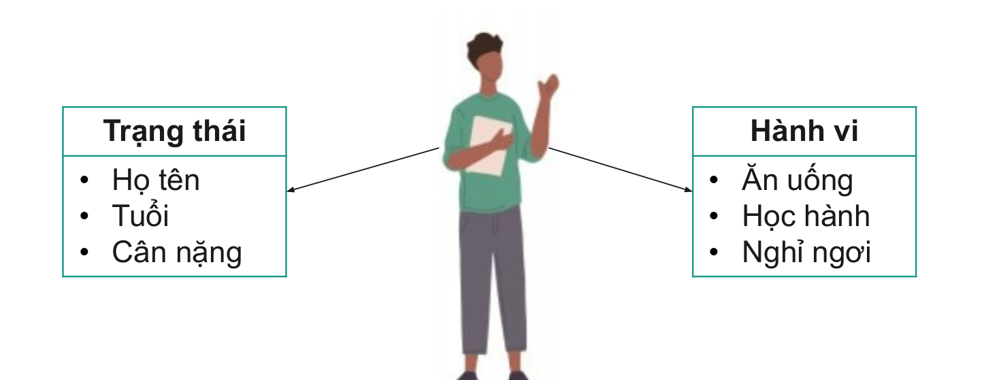
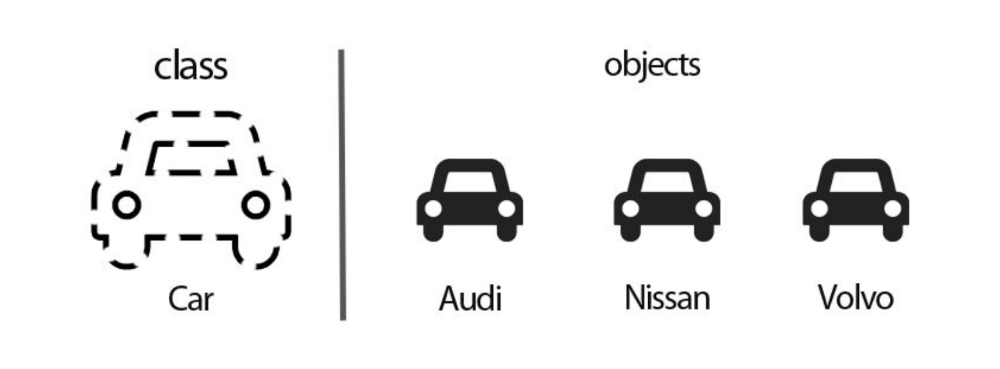

## Đối tượng (Object)  
Đối tượng là khái niệm cơ sở, quan trọng nhất của cash tiếp cận hướng đối tượng. Đối tượng là thực thể của hệ thống, của Cơ sở dữ liệu và được xác định thông qua định danh ID của chúng.  
Đối tượng là thực thể mang tính vật lý. Nó bao gồm các đặc trưng sau:  
    

Trong đó:   
- **Trạng thái**: Là những thông tin của đối tượng, như: Con người có tên, tuổi, địa chỉ,...  
- **Hành vi**: Là các thao tác, hoạt động của một đối tượng, như: Con người có thể đi học, đi làm, ăn uống,...  

## Lớp (Class)  

Lớp là tập hợp các đối tượng có cùng trạng thái, hành vi hay là một nhóm các đối tượng có chung thuộc tính  

  

Một lớp trong Java có thể chứa:  
- Thành viên dữ liệu  
- Constructor  
- Phương thức
- Khối lệnh  
- Lớp và interface  


## So sánh lớp và đối tượng  

| Đối tượng | Lớp |
| --- | --- |
| Đối tượng là thực thể trong thế giới thực: Con người, xe cộ, nhà cửa,... | Lớp gồm một nhóm các đối tượng tương tự nhau |
| Mang tính vật lý | Mang tính logic |
| Có thể tạo nhiều lần | Được khai báo một lần duy nhất |
| Đối tượng được cấp bộ nhớ khi nó được tạo ra | Lớp không được cấp bộ nhớ khi nó được tạo ra |  
| Có nhiều cách để tạo ra một đối tượng trong Java | Chỉ có một cách để định nghĩa lớp trong Java là sử dụng từ khóa class |

## Tạo lớp và tạo đối tượng
### Tạo lớp   

Cú pháp:  
```java
<Phạm vi truy cập> class <Tên lớp>{

}
```

Ví dụ: Tạo lớp liên quan đến con người, gồm có 2 thuộc tính là tên và tuổi và có 2 phương thức `eat()` và `study()`  

```java
public class Person {
    public String name;
    public int age;

    public void eat(){
        System.out.println("Method eat() is called!!!");
    }

    public void study(String subject){
        System.out.println("Method study is called!!!");
        System.out.println(subject);
    }
}
```   

### Tạo đối tượng  
Cú pháp tạo đối tượng  
```java
<Tên class> <Tên biến tham chiếu> = new <Tên Class>();  
```

Gán giá trị cho thuộc tính:  
```java
<Tên biến tham chiếu>.<Thuộc tính> = <Giá trị>;  
```

Gọi phương thức:  
```java
<Tên biến tham chiếu>.<Tên phương thức>(<Các tham số>);
```  

Ví dụ: Thực hiện tạo đối tượng với class Person đã tạo trong phần **Tạo lớp**  
```java
public class Main {
    public static void main(String[] args) {
        Person person = new Person();
        person.name = "Ngọc";
        person.age = 25;

        System.out.println(person.name + " - " + person.age);

        person.eat();
        person.study("Java");
    }
}
```
