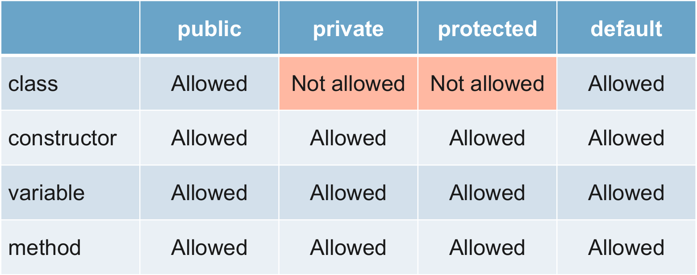
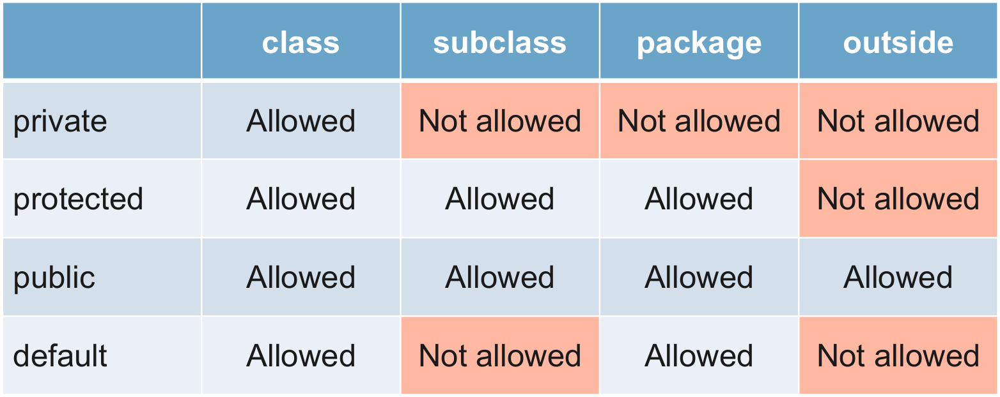
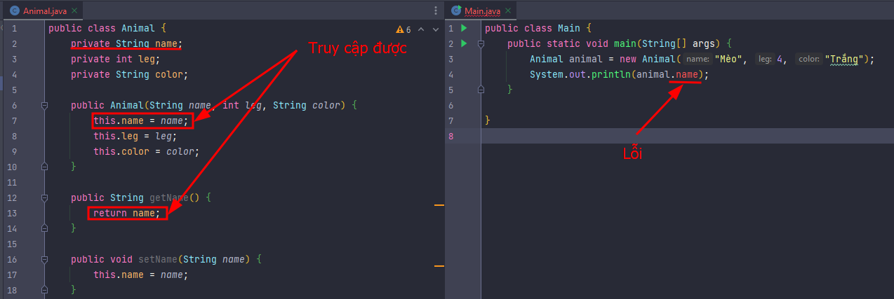
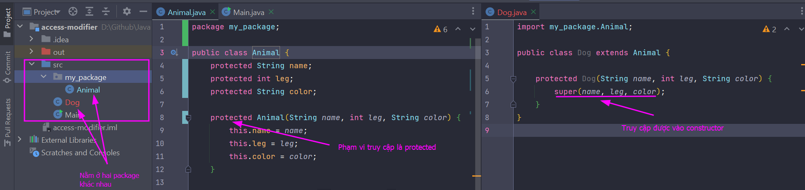
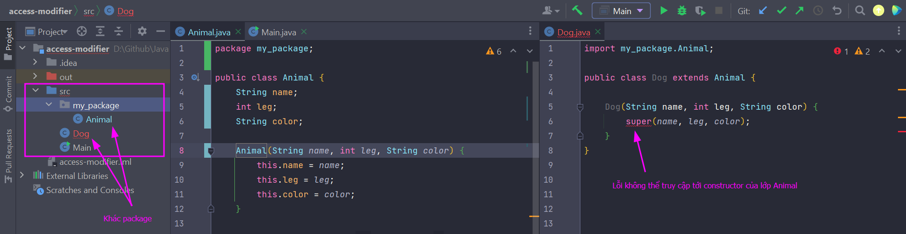

## Phạm vi truy cập 

Phạm vi truy cập (Access modifiers) là xác định mức độ truy cập vào dữ liệu của các thuộc tính, phương thức hoặc class.  

## Các loại phạm vi truy cập  

Có 4 loại phạm vi truy cập:  
- `private`
- `default`
- `protected`
- `public`  

  

### private  
`private` xác định phạm vi truy cập nội bộ của một class. Chỉ có thể sử dụng `private` với constructor, biến, và phương thức  

Ví dụ: Cho thuộc tính `name` của class `Animal` có phạm vi truy cập là `private`, thì chỉ có thể truy cập biến `name` trong class `Animal`. Nếu truy cập vào biến `name` từ class `Main` thì ngay lập tức bị lỗi  

  

### protected  
`protected` là phạm vi truy cập có thể từ trong và ngoài Package, nhưng phải thông qua tính kế thừa  
  

### default  
Đây là phạm vi truy cập mặc định, khi bạn không ghi gì hết thì nó để phạm vi truy cập ở dạng này. với `default`, phạm vi truy cập chỉ năm trong nội bộ package  

### public  
Đây phạm vi truy cập rộng, có thể truy cập bất cứ đâu trong project Java. Tất nhiên khi khác package để cần phải khai báo import để xác định ví trí của class như phần giải thích trên trên.