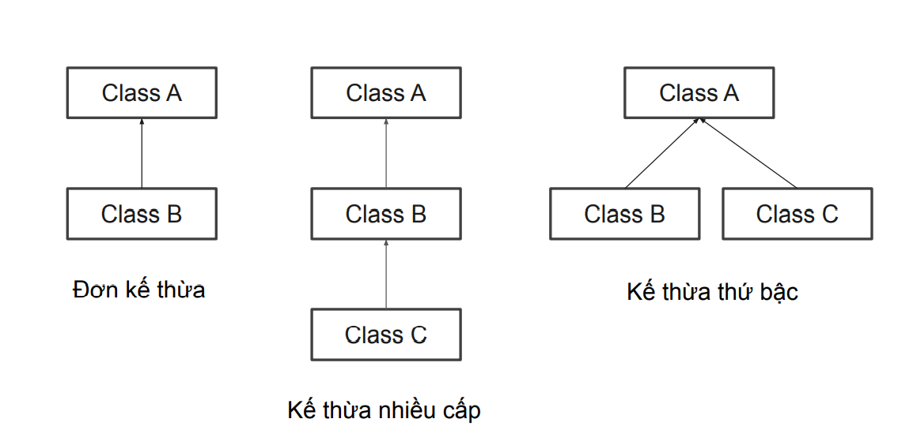

## Kế thừa trong Java  
Tính kế thừa là 1 trong 4 nguyên lý cơ bản của OOP  
Trong Java, kế thừa đề cập đến việc tất cả các thuộc tính và phương thức của lớp  này có thể kế thừa bởi một lớp khác  
Để kế thừa một lớp, ta sử dụng từ khóa `extends`  
```java
public class Animal {
 	public void eat(){
 		System.out.println("Eating...");
 	}
}
```  

```java
public class Cat extends Animal {
	public void sound(){
 		System.out.println("Meow...");
 	}
}
```  

```java
public class Main {
	public static void main(String[] args) {
		Cat cat = new Cat();
		cat.eat();
		cat.sound();
	}
}
```  

## Các loại kế thừa trong Java  
Có 3 kiểu kế thừa trong Java đó là đơn kế thừa, kế thừa nhiều cấp, kế thừa thứ bậc.  

  
Khi một class được kế thừa từ nhiều class được gọi là đa kế thừa. Trong Java, đa kế thừa chỉ được hỗ trợ thông qua `interface`  

## Từ khóa super
   
Từ khóa super trong Java là một biến tham chiếu được sử dụng để tham chiếu trực tiếp đến đối tượng của lớp cha gần nhất.   
Bất cứ khi nào bạn tạo ra instance của lớp con, một instance của lớp cha được tạo ra ngầm định, nghĩa là được tham chiếu bởi biến super  

## Các cách sử dụng từ khóa super
- Gọi trực tiếp đến constructor của lớp cha gần nhất 
- Gọi trực tiếp thuộc tính (biến) của lớp cha gần nhất
- Gọi trực tiếp phương thức của lớp cha gần nhất

Ví dụ:  
```java
public class Person {
    public String name;
    public int age;
    public String address;

    public Person(String name, int age, String address) {
        this.name = name;
        this.age = age;
        this.address = address;
    }

    public void print(){
        System.out.println("Tên: " + name);
        System.out.println("Tuổi: " + age);
        System.out.println("Địa chỉ: " + address);
    }
}
```  
```java
public class Student extends Person{
    public double GPA;

    public Student(String name, int age, String address, double GPA) {
        super(name, age, address); //Tham chiếu tới constructor của lớp Person
        this.GPA = GPA;
    }

    public void printParent(){
        System.out.println(super.name); //Tham chiếu đến biến của lớp Person
    }

    @Override
    public void print() {
        super.print(); //Tham chiếu đến phương thức của lớp Person
        System.out.println("GPA: " +GPA);
    }
}

```

Hãy thử comment các dòng   
```java
super(name, age, address);
System.out.println(super.name); 
super.print(); 
```
Và xem kết quả nhé