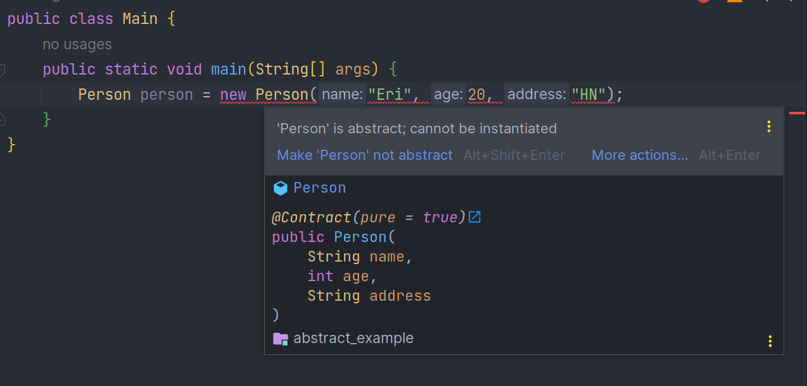

## Tính trừu tượng trong lập trình

Tính trừu tượng trong lập trình là là tính chất không thể hiện cụ thể mà chỉ nêu tên vấn đề, chỉ hiển thị tính năng thiết yếu đối với đối tượng người dùng mà không nói rõ quy trình hoạt động.
Ví dụ: Một người sử dụng điện thoại để gửi tin nhắn, người này chủ cần thực hiện soạn nội dung tin, nhập thông tin người gửi và ấn nút gửi. Còn quy trình xử lý tin nhắn gửi đi như nào thì người này không biết. Đó là tính trừu tượng.
Như vậy tính trừu tượng chỉ cung cấp thông tin đối tượng thay vì cách nó sử dụng như nào. Nó có nhưng ưu điểm như sau:  
* Tính trừu tượng cho phép các lập trình viên loại bỏ tính chất phức tạp của đối tượng bằng cách chỉ đưa ra các thuộc tính và phương thức cần thiết của đối tượng trong lập trình, cải thiện khả năng bảo trì của hệ thống.
* Tính trừu tượng giúp chúng ta tập trung vào những cốt lõi cần thiết của đối tượng thay vì quan tâm đến cách nó thực hiện.

## Tính trừu tượng trong Java  
Tính trừu tượng trong java thể hiện qua phương thức trừu tượng (Abstract Method), lớp trừu tượng (Abstract Class) và các giao diện (Interface) sẽ được giới thiệu trong các bài sau.  

Tính trừu tượng cung cấp nhiều tính năng mở rộng khi sử dụng kết hợp với tính đa hình và kế thừa trong lập trình hướng đối tượng.


### Lớp trừu tượng  
Lớp trừu tượng là lớp bị hạn chế, không thể dùng để tạo đối tượng (Để truy cập nó phải kế thừa từ lớp khác)  
Để tạo lớp trừu tượng ta sử dụng từ khóa `abstract` trước từ khóa `class`:  

```java
public abstract class Person {
    private String name;
    private int age;
    private String address;

    public Person(String name, int age, String address) {
        this.name = name;
        this.age = age;
        this.address = address;
    }

    public String getName() {
        return name;
    }

    public void setName(String name) {
        this.name = name;
    }

    public int getAge() {
        return age;
    }

    public void setAge(int age) {
        this.age = age;
    }

    public String getAddress() {
        return address;
    }

    public void setAddress(String address) {
        this.address = address;
    }
}
```  

Trong trường hợp này nếu ta cố tạo đối tượng lớp `Person` thì sẽ báo lỗi. 

  

Tuy nhiên, ta có thể tạo đối tượng từ lớp kế thừa lớp `Person`:  

```java
public class Student extends Person {
    public Student(String name, int age, String address) {
        super(name, age, address);
    }
}
```

```java
public class Main {
    public static void main(String[] args) {
        Student student = new Student("Eri", 20, "HN");
    }
}
```

### Phương thức trừu tượng
Chỉ có thể được sử dụng trong một lớp trừu tượng và nó không có phần thân. Phần thân được cung cấp bởi lớp con
Trong lớp trừu tượng có thể có cả phương thức trừu tượng và phương thức thông thường

Việc sử dụng lớp trừu tượng và thuộc tính trừu tượng nhằm đạt được tính bảo mật. Hãy ẩn các chi tiết nhất định và chỉ hiển thị các chi tiết quan trọng của một đối tượng  

Ví dụ: Tạo phương thức trừu tượng trong class `Person` và bắt lớp `Student` phải override lại

```java
public abstract class Person {
    //...
    public abstract void print();
}
```

```java
public class Student extends Person {
    //...
    @Override
    public void print() {
        System.out.println("Phương thức được override");
    }
}
```