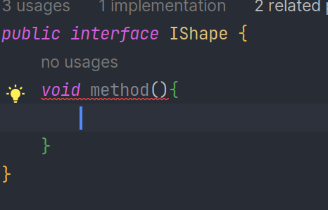
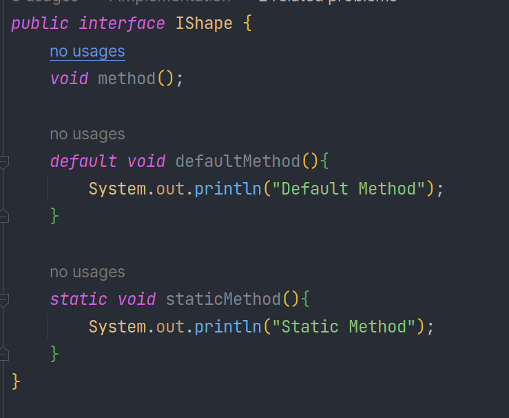

## Interface là gì? 
Interface là một kiểu dữ liệu tham chiếu trong Java. Nó là tập hợp các phương thức abstract. Khi một lớp triển khai interface, thì nó sẽ hiện thực hóa những mẫu hàm của interface đó.  

## Một số quy tác khi sử dụng interface  
- Interface không có constructor, không thể tạo đối tượng từ interface  
- Tất cả các phương thức của interface đều là abstract  
- Một interface có thể kế thừa từ một interface khác  
- Một interface không thể kế thừa từ một lớp  
- Sử dụng từ khóa `implement` để triển khai một interface   

## Tạo interface  
**Cú pháp:**  
```java
interface <Tên Interface>{
 //Các thành phần bên trong interface
}
```  

**Ví dụ:** 
```java
public interface Flying {
   void fly();

   void flapWings();
}
```

```java
public class Bird implements Flying{
   private String name;

   @Override
   public void fly() {
       System.out.println(name + " is flying!");
   }

   @Override
   public void flapWings() {
       System.out.println(name + " is flapping its wings!");
   }
}
```

## Tại sao lại sử dụng interface  
- interface định nghĩa các tập hành vi mà class tuân thủ hơn là kế thừa  
- Java không hỗ trợ đa kế thừa. Do đó, ta không thể kế thừa cùng một lúc nhiều class. Để giải quyết vấn đề này interface ra đời  

## Static và default trong interface  
Trong nội dung trên chúng ta đề cập tới interface gồm các phương thức không có phần thân. Tuy nhiên, từ phiên bản Java 8, chúng ta có thể thêm các phương thức có phần thân bằng cách sử dụng từ khóa `default` và `static`  

Ví dụ:   
  
Trong trường hợp trên, khi mình thêm phần thân vào phương thức `method()` thì có lỗi xảy ra vì trong interface chỉ chứa các phương thức không có phần thân.  
Giờ hãy sử dụng từ khóa `default` và `static`  
  
Phương thức `defaultMethod()` chính là phương thức default của interface IShape, nó không bắt buộc phải implement phương thức default  
Tính năng này sẽ giúp chúng ta mở rộng các phương thức bổ sung phát sinh sau này mà không ảnh hưởng đến các class liên quan, chúng ta chỉ cần viết thêm các phương thức default trong interface
